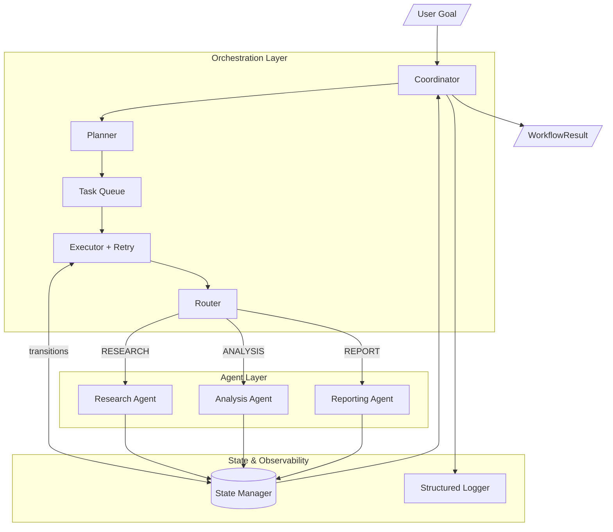
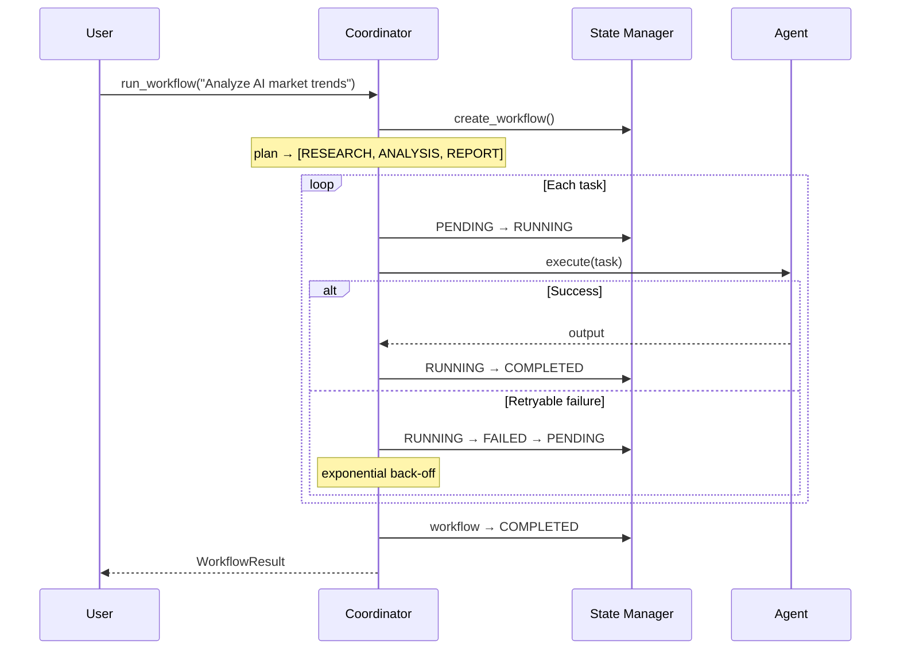

# AI Coordination System

A production-grade multi-agent orchestration framework that manages specialized AI agents working together toward a shared objective. Built to demonstrate the architecture patterns expected of Staff AI Engineers, Forward Deployed Engineers, and AI Platform leads.

---

## Problem Statement

Modern AI applications rarely depend on a single model call. Complex goals — market research, competitive analysis, long-form synthesis — require a coordinated pipeline of specialized agents where each step builds on the last. Without an orchestration layer, these pipelines are brittle: failures cascade silently, state is untracked, retries are ad hoc, and there is no single view of workflow health.

This system provides that orchestration layer: a typed, observable, fault-tolerant framework that manages the full lifecycle of multi-agent workflows from goal intake to final output.

---

## Architecture



### Workflow Sequence



---

## System Components

| Component | Responsibility |
|-----------|---------------|
| **Coordinator** | Top-level orchestrator. Plans tasks, drives execution, handles retries, aggregates results. |
| **Planner** | Builds an ordered task DAG from a user goal (linear pipeline today; DAG-ready interface). |
| **Router** | Registry-based dispatch: maps `TaskType → BaseAgent`. Supports runtime overrides for testing. |
| **State Manager** | Thread-safe in-memory state store. Enforces valid state machine transitions for tasks and workflows. |
| **Task Queue** | Thread-safe FIFO queue. Decouples planning from execution. |
| **BaseAgent** | Abstract contract all agents implement: `execute(task) → dict`. |
| **ResearchAgent** | Collects structured findings from configured sources. |
| **AnalysisAgent** | Extracts ranked insights and risk factors from research output. |
| **ReportingAgent** | Renders a structured strategic report from analysis. |
| **StructuredLogger** | JSON-formatted logs with timestamps, agent names, task IDs, and durations. |

### State Machines

**Task:**
```
PENDING → RUNNING → COMPLETED  (terminal)
                  → FAILED     → PENDING  (retry reset)
```

**Workflow:**
```
PENDING → RUNNING → COMPLETED  (terminal — all tasks succeeded)
                  → FAILED     (terminal — first task failed with no prior output)
                  → PARTIAL    (terminal — a mid-pipeline task failed after partial output)
```

---

## Workflow Example

**Goal:** `"Analyze AI market trends and produce a strategic report"`

```
Coordinator receives goal
       ↓
Planner creates execution plan:
  Task 1: RESEARCH  (no dependencies)
  Task 2: ANALYSIS  (depends on Task 1)
  Task 3: REPORT    (depends on Task 2)
       ↓
Task Queue: [RESEARCH, ANALYSIS, REPORT]
       ↓
Executor dequeues RESEARCH
  → Router → ResearchAgent.execute()
  → Output: { research: { findings: [...], data_quality_score: 0.92 } }
  → StateManager: RUNNING → COMPLETED
       ↓
Executor dequeues ANALYSIS (receives research output via input_data)
  → Router → AnalysisAgent.execute()
  → Output: { analysis: { key_themes: [...], strategic_insights: [...] } }
  → StateManager: RUNNING → COMPLETED
       ↓
Executor dequeues REPORT (receives analysis output via input_data)
  → Router → ReportingAgent.execute()
  → Output: { report: { title: "...", executive_summary: "...", recommendations: [...] } }
  → StateManager: RUNNING → COMPLETED
       ↓
Coordinator: workflow → COMPLETED
Return: WorkflowResult(status=COMPLETED, output={research, analysis, report})
```

---

## Project Structure

```
ai-coordination-system/
├── main.py                          # Demo entry point
├── requirements.txt
├── pyproject.toml
├── README.md
├── docs/
│   ├── architecture.md              # Deep-dive architecture reference
│   ├── design_decisions.md          # Architecture decision records
│   └── project_plan.md              # Roadmap and milestones
├── src/
│   ├── models/
│   │   └── task.py                  # Task, WorkflowState, WorkflowResult, enums
│   ├── agents/
│   │   ├── base_agent.py            # Abstract BaseAgent + AgentError
│   │   ├── research_agent.py
│   │   ├── analysis_agent.py
│   │   └── reporting_agent.py
│   ├── coordinator/
│   │   ├── coordinator.py           # Main orchestration engine
│   │   ├── router.py                # TaskType → agent dispatch
│   │   ├── state_manager.py         # State machine + persistence
│   │   └── task_queue.py            # Thread-safe FIFO queue
│   └── utils/
│       └── logging_utils.py         # Structured JSON logger + @timed decorator
└── tests/
    ├── conftest.py                  # Shared fixtures
    ├── test_router.py
    ├── test_state_manager.py
    ├── test_task_queue.py
    ├── test_coordinator.py
    └── test_agents.py
```

---

## Installation

```bash
git clone https://github.com/fc-grcs/ai-coordination-system.git
cd ai-coordination-system

python -m venv .venv
source .venv/bin/activate        # Windows: .venv\Scripts\activate

pip install -e ".[dev]"
# or: pip install -r requirements.txt
```

---

## Usage

### Run the demo

```bash
PYTHONPATH=src python main.py
# Custom goal:
PYTHONPATH=src python main.py "Evaluate the competitive landscape for vector databases"
```

### Example output

```
Goal: Analyze AI market trends and produce a strategic report
────────────────────────────────────────────────────────────

Workflow ID : a3f2c1d0-...
Status      : COMPLETED
Duration    : 0.31s

────────────────────────────────────────────────────────────
Title: Strategic Report: Analyze AI market trends...

Executive Summary:
  This report analyzes 4 data sources with an aggregate confidence
  of 88%, surfacing 3 strategic insights across 4 key themes.

Strategic Recommendations:
  1. [93%] Agent orchestration is becoming the dominant architecture pattern
  2. [89%] Enterprise ROI timelines have compressed 3x
  3. [82%] Multi-modal models will commoditize specialist systems

────────────────────────────────────────────────────────────
Task execution history:
  ✓ research   [0.101s]
  ✓ analysis   [0.100s]
  ✓ report     [0.100s]
```

### Programmatic usage

```python
from coordinator.coordinator import Coordinator
from coordinator.router import Router
from agents.research_agent import ResearchAgent
from models.task import TaskType

# Use default pipeline
coordinator = Coordinator()
result = coordinator.run_workflow("Analyze AI market trends")

print(result.status)        # WorkflowStatus.COMPLETED
print(result.duration_seconds)
print(result.output["report"]["executive_summary"])

# Inject a custom agent
router = Router()
router.register(TaskType.RESEARCH, MyCustomResearchAgent())
coordinator = Coordinator(router=router)
```

---

## Testing

```bash
# Run full suite
PYTHONPATH=src pytest

# With verbose output
PYTHONPATH=src pytest -v

# Single module
PYTHONPATH=src pytest tests/test_coordinator.py -v

# Coverage
PYTHONPATH=src pytest --cov=src --cov-report=term-missing
```

The test suite covers:

| Area | Tests |
|------|-------|
| Routing | Correct agent dispatch, unregistered type error, runtime override |
| State transitions | Valid paths, illegal transitions, retry reset semantics |
| Task queue | FIFO ordering, empty dequeue, batch operations |
| Coordinator (happy path) | Full pipeline output, duration tracking, history |
| Coordinator (failures) | Retry trigger, max retries exhausted, PARTIAL vs FAILED status |
| Agents | Output schema, input validation, goal propagation |

---

## Future Improvements

| Area | Enhancement |
|------|-------------|
| **LLM Integration** | Swap simulated agents for real Anthropic/OpenAI API calls with streaming |
| **DAG Execution** | Topological sort for parallel branches (e.g., concurrent research sub-tasks) |
| **Persistence** | Replace in-memory StateManager with Redis or Postgres backend |
| **API Layer** | FastAPI REST endpoints for workflow submission and status polling |
| **Human-in-the-loop** | Escalation queue for high-risk or low-confidence tasks |
| **Streaming** | SSE/WebSocket progress events as each task completes |
| **Evaluation** | LLM-as-judge scoring of agent outputs with confidence thresholds |
| **Distributed Execution** | Celery or Temporal worker pool for horizontal scale |
| **Observability** | OpenTelemetry traces + Prometheus metrics for production monitoring |
